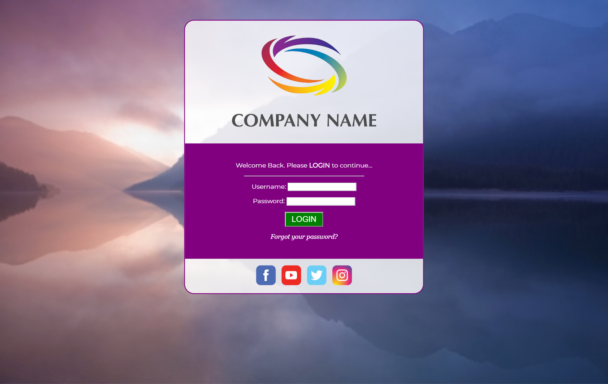

# web-dev-user-login
Design Resources for Web Dev User Login Assignment

<h2>Screen Shot</h2>

<h2>Style Notes</h2>
<h3>Page Layout</h3>
<!-- 
Use a centered-fixed-width layout: login box width: 600px (all content centered)
 -->

<h3>Fonts</h3>
<ul>
  <!-- <li>base font is 'Montserrat' (from Google Fonts)</li> -->
  <!-- <li>'Forgot your password?' text is 'Georgia' and italic</li> -->
  <!-- <li>Login button is 20px</li> -->
</ul>

<h3>Colors</h3>
<ul>
  <!-- <li>Login box background is 'rgba(255, 255, 255, 0.8)'</li> -->
  <!-- <li>Username and Password area and entire box border are 'purple'</li> -->
  <!-- <li>Button background is 'green' and button text is 'white'</li> -->
</ul>

<h3>Links</h3>
<ul>
  <!-- <li>'Forgot your password?': "https://www.wikihow.com/Remember-Passwords"</li>
  <li>Facebook Icon: "https://www.facebook.com/"</li>
  <li>YouTube Icon: "https://www.youtube.com/"</li>
  <li>Twitter Icon: "https://twitter.com/"</li>
  <li>Instagram Icon: "https://www.instagram.com/"</li> -->
</ul>
<!-- 
Open all links in a new tab/window
 -->
<!-- 
'Forgot your password?' link should show an underline and turn 'yellow' on hover
 -->
